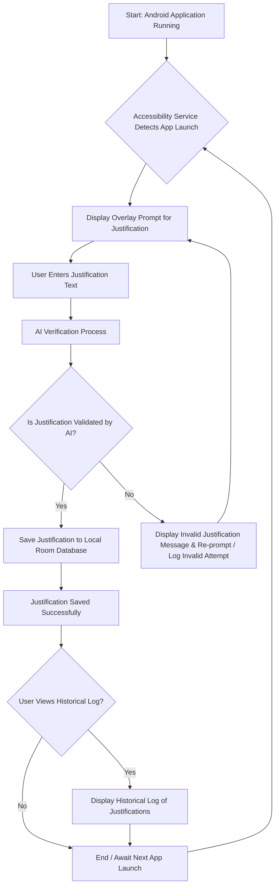

# Tell Me Why

This App is gateway to  interrupt automatic digital habits. In a world where it's easy to slip into endless scrolling, this app introduces a moment of pause  a simple, thoughtful question: "Why are you opening that app?" By prompting users to reflect before engaging with potentially distracting apps, TellMeWhy encourages greater self-awareness and intentional use of technology. It's a small moment that can lead to more focused decisions, helping users break patterns of mindless usage.

The result is improved focus, reduced digital fatigue, and a more mindful relationship with your device — one that supports your productivity, not undermines it.

## Features
*   Track application launches using Android's Accessibility Service.
*   Display an overlay prompt to enter a justification.
*   Uses AI to verify the justification process
*   Save justifications to a local Room database.
*   View a historical log of all justifications.

## Flow

## How to Contribute

Contributions are welcome! If you'd like to contribute, please follow these guidelines:

1.  **Fork the repository.**
2.  **Create a new branch** for your feature or bug fix:
    ```bash
    git checkout -b feature/your-feature-name
    ```
3.  **Make your changes.** Please adhere to the existing code style and architectural patterns.
4.  **Add OPENROUTER_API_KEY** to your local.properties
5.  **Ensure the app builds and runs** without any new errors or warnings.
6.  **Create a Pull Request** with a clear and descriptive title and summary of your changes.

---
